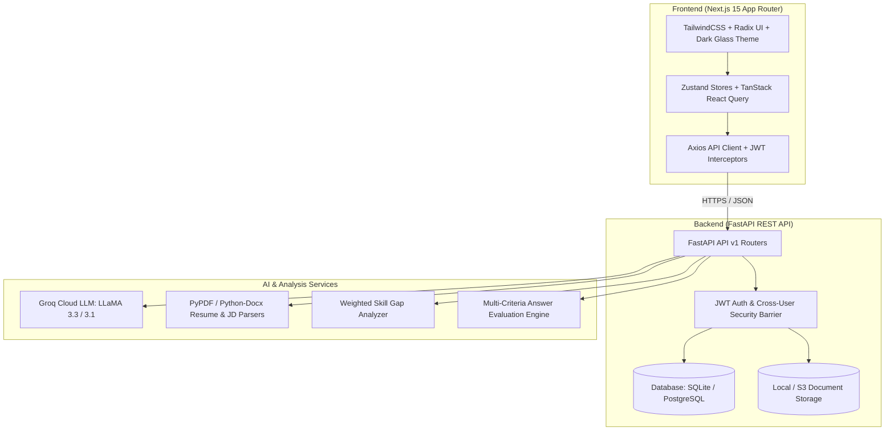

# InterviewForge AI

<div align="center">


**AI-powered personalized technical and behavioral interview preparation platform.**  
Analyze skill gaps, generate tailored mock interview questions, practice real-time responses, and receive granular AI evaluations.

[Live Application Demo](https://interviewforge-frontend-qusq.onrender.com) • [Backend API](https://interviewforge-backend-busg.onrender.com) • [Interactive API Docs](https://interviewforge-backend-busg.onrender.com/docs)

</div>

---

## 📌 Problem Statement

Preparing for software engineering and technical interviews is often disjointed:
- **Generic Question Banks**: Traditional platforms present static, one-size-fits-all question sets that ignore a candidate's actual resume experience and target role requirements.
- **Blind Skill Gaps**: Candidates often don't know which specific skills or keywords in a target Job Description (JD) are missing from their resumes before walking into an interview.
- **Lack of Actionable Feedback**: Answering practice questions without objective scoring, concept identification, and model response comparisons leaves candidates unprepared for rigorous technical scrutiny.

## 🎯 Project Goals

1. **Targeted Preparation**: Extract structured skills and experience from resumes and job descriptions using automated parsing and vector similarity.
2. **Context-Aware Generation**: Generate domain-specific interview questions grounded in candidate strengths, weaknesses, and job requirements.
3. **Structured Evaluation**: Score candidate answers across multiple dimensions (correctness, depth, communication clarity, relevance) and provide constructive feedback with ideal model answers.

---

## 🚀 Live Deployments

| Component | Service | URL | Status |
| :--- | :--- | :--- | :--- |
| **Frontend Web App** | Render (Next.js Node Web Service) | [https://interviewforge-frontend-qusq.onrender.com](https://interviewforge-frontend-qusq.onrender.com) | `Online` |
| **Backend REST API** | Render (FastAPI Python Service) | [https://interviewforge-backend-busg.onrender.com](https://interviewforge-backend-busg.onrender.com) | `Online` |
| **Interactive API Docs** | Swagger UI / OpenAPI 3.1 | [https://interviewforge-backend-busg.onrender.com/docs](https://interviewforge-backend-busg.onrender.com/docs) | `Online` |
| **Readiness Probe** | API Health & DB Connectivity | [https://interviewforge-backend-busg.onrender.com/health/ready](https://interviewforge-backend-busg.onrender.com/health/ready) | `Online` |

---

## ✨ Implemented & Verified Features

### 1. 🔐 Authentication & Session Security
- User registration and login with bcrypt password hashing.
- Strictly partitioned JWT Access and Refresh tokens with automatic client session state management.
- Multi-user data isolation: every resource query enforces user ID ownership checks.

### 2. 👤 Multi-Profile Management
- Create, manage, and switch between multiple career profiles (e.g., *Frontend Engineer*, *DevOps Specialist*, *Backend Lead*).
- Profile metadata includes headlines, target roles, experience levels, and bio information.

### 3. 📄 Resume Upload & Automated Parsing
- Support for PDF, DOCX, and plain text resumes.
- Automated extraction and categorization of technical skills, projects, work experience, education, and certifications.
- Raw text fallback editing and multi-resume version storage per profile.

### 4. 📋 Job Description (JD) Analysis
- Target job specification ingestion with role, company, and detailed description requirements.
- Automated requirement extraction classifying core required vs. preferred skills and experience levels.

### 5. 📊 Skill Gap Analysis Engine
- Direct comparison between candidate resume competencies and JD requirements.
- Deterministic readiness scoring (0–100) weighted by required skills (80%) and preferred skills (20%).
- Detailed breakdown: **Matched Skills**, **Missing Skills (Required vs. Preferred)**, and **Priority Recommendations**.

### 6. 🤖 Context-Aware AI Interview Generation
- Generates categorized interview questions grounded in active resume and JD context via Groq LLM API.
- **Categories Supported**:
  - `Technical`: Core language, architecture, algorithms, and system concepts.
  - `HR / Behavioral`: Culture fit, collaboration, conflict resolution, and situational problem-solving.
  - `Situational`: Scenario-based incident triage and engineering decision-making.
  - `Resume-Based`: Questions targeted specifically at projects, frameworks, and achievements listed on the candidate's resume.
- Configurable difficulty (`easy`, `medium`, `hard`) and question volume (5–20 questions).

### 7. ✍️ Practice & AI Answer Evaluation
- Interactive practice view to navigate questions, record answers, and skip or revisit prompts.
- Multi-dimensional answer scoring:
  - **Correctness Score** (40% weight)
  - **Depth Score** (30% weight)
  - **Communication & Clarity** (15% weight)
  - **Relevance Score** (15% weight)
- Delivers strengths, identified weaknesses, missing key concepts, and an improved model answer.

### 8. 📈 Performance Analytics
- Historical snapshot tracking of interview scores over time.
- Breakdown of strongest and weakest skill domains with JD requirement indicators.

---

## 🏗️ System Architecture



---

## 🛠️ Technology Stack

### Frontend
- **Framework**: Next.js 15 (App Router, Server Components & Client Hooks)
- **Language**: TypeScript 5.7
- **UI & Styling**: React 19, TailwindCSS 3.4, Radix UI Primitives, Lucide Icons, Sonner Notifications
- **State & Server Cache**: Zustand 5.0, TanStack React Query 5.62
- **Forms & Validation**: React Hook Form, Zod
- **Data Visualization**: Recharts

### Backend
- **Framework**: FastAPI (Python 3.11 / 3.13 compatible, Async ASGI)
- **Database & ORM**: SQLAlchemy 2.0 ORM, SQLite (local development), PostgreSQL (production-ready)
- **Migrations**: Alembic
- **Authentication**: Python-JOSE (JWT tokens), Passlib (Bcrypt hashing)
- **Document Processing**: PyPDF, Python-docx, Python-multipart
- **AI & RAG**: Groq API SDK (LLaMA-3 models), Sentence-Transformers & FAISS embeddings
- **Server**: Uvicorn ASGI Server

---

## 🔄 Application Workflow

```
1. Register / Login
   └─ Authenticate via secure JWT session
      │
2. Create Career Profile
   └─ Define target role and domain focus
      │
3. Upload Resume + Add Job Description
   └─ Automated parsing extracts skills, projects, and requirements
      │
4. Run Skill Gap Analysis
   └─ View readiness score (0-100), matched competencies, and missing skills
      │
5. Generate Tailored Interview
   └─ Select type (Technical, HR, Situational, Mixed) & difficulty
      │
6. Practice & Submit Answers
   └─ Complete timed question prompts
      │
7. AI Evaluation & Scoring
   └─ Receive multi-criteria scores, missing concepts, and model answers
```

---

## 💻 Local Development Setup

### Prerequisites
- Node.js 18.18+ or 20+
- Python 3.11+
- Git

---

### 1. Backend Setup

```bash
# Navigate to the backend directory
cd InterviewForge-AI-Backend

# Create and activate a virtual environment
python3 -m venv venv
source venv/bin/activate  # On Windows: venv\Scripts\activate

# Install dependencies
pip install -r requirements.txt

# Configure environment variables
cp .env.example .env
# Edit .env and supply your GROQ_API_KEY and JWT_SECRET_KEY

# Run database migrations
alembic upgrade head

# Start the FastAPI development server
uvicorn app.main:app --reload --host 0.0.0.0 --port 8000
```
The backend will be live at `http://localhost:8000`. Interactive docs are available at `http://localhost:8000/docs`.

---

### 2. Frontend Setup

```bash
# Navigate to the frontend directory
cd InterviewForge-AI

# Install dependencies
npm install

# Configure environment variables
cp .env.example .env.local
# Set NEXT_PUBLIC_API_BASE_URL=http://localhost:8000/api/v1

# Run development server
npm run dev
```
Open [http://localhost:3000](http://localhost:3000) in your browser.

---

## ⚙️ Environment Variables Reference

### Frontend (`.env.local`)
| Variable | Description | Example |
| :--- | :--- | :--- |
| `NEXT_PUBLIC_API_BASE_URL` | Backend API v1 Base URL | `http://localhost:8000/api/v1` |

### Backend (`.env`)
| Variable | Description | Example |
| :--- | :--- | :--- |
| `ENVIRONMENT` | Environment mode | `development` or `production` |
| `DATABASE_URL` | SQLAlchemy connection string | `sqlite+aiosqlite:///./interviewforge.db` |
| `SECRET_KEY` | Secret key for JWT cryptographic signing | `your-secure-random-secret-key` |
| `GROQ_API_KEY` | Groq Cloud API Key for LLM inference | `gsk_...` |
| `CORS_ORIGINS` | Comma-separated list of allowed origins | `http://localhost:3000,https://interviewforge-frontend-qusq.onrender.com` |

---

## 🧪 Testing & Quality Assurance

### Frontend Testing & Verification
```bash
# Run unit & integration tests
npm test

# Run TypeScript type verification
npm run type-check

# Run ESLint validation
npm run lint

# Build production bundle
npm run build
```

### Backend Testing & Audit Suite
```bash
# Activate virtual environment
source venv/bin/activate

# Run full pre-deployment test suite
python tests/test_deployment_audit.py

# Run individual test phases
python tests/test_phase2.py   # Auth & Profiles
python tests/test_phase3.py   # Resume Upload & Parsing
python tests/test_phase4.py   # Job Description Analysis
python tests/test_phase5.py   # Skill Gap Analysis
python tests/test_phase6.py   # Question Generation
python tests/test_phase7.py   # Mock Interview & Answer Evaluation
python tests/test_phase8_production.py # Full Production Audit
```

---

## 📡 API Overview

| Method | Endpoint | Description |
| :--- | :--- | :--- |
| `GET` | `/health` | Liveness probe returning service status |
| `GET` | `/health/ready` | Readiness probe verifying DB connectivity |
| `POST` | `/api/v1/auth/register` | Register new user account |
| `POST` | `/api/v1/auth/login` | Login and acquire JWT access + refresh tokens |
| `GET` | `/api/v1/profiles` | List profiles belonging to authenticated user |
| `POST` | `/api/v1/profiles` | Create new career profile |
| `POST` | `/api/v1/profiles/{id}/resumes/upload` | Upload PDF/DOCX/TXT resume file |
| `POST` | `/api/v1/profiles/{id}/job-descriptions` | Create and store job description |
| `POST` | `/api/v1/profiles/{id}/resumes/{r_id}/job-descriptions/{jd_id}/analyze` | Execute skill gap analysis |
| `POST` | `/api/v1/profiles/{id}/interview-questions/generate` | Generate context-grounded interview questions |
| `POST` | `/api/v1/profiles/{id}/interviews/{id}/answers/{a_id}/evaluate` | Evaluate candidate answer and get scores |

---

## ⚠️ Current Limitations & Known Considerations

- **Text-Based Interaction**: Mock interviews and answer evaluations currently operate over typed text responses. Real-time audio speech-to-text / video avatar streams are not part of the active release.
- **Single Active Resume / JD Pairing**: While multiple resumes and JDs can be stored, the automated skill gap engine matches one selected resume against one target job description per analysis run.
- **Cold Start on Free Tier**: Render free-tier instances may sleep after periods of inactivity, resulting in a brief initial spin-up latency on first request.

---

## 🔮 Future Roadmap

- [ ] **Voice-Based Interviewing**: WebRTC and Whisper AI speech-to-text integration for real-time verbal practice.
- [ ] **Custom Agent Graphs**: Configurable multi-step AI coaching pipelines with custom rubrics.
- [ ] **7/14/30-Day Learning Roadmaps**: Dedicated UI page to render personalized day-by-day study plans generated from skill gap deficits.
- [ ] **Coding Sandbox**: Embedded Monaco code editor for live coding challenges with automated test runners.

---

## 👨‍💻 Author

**Prince Yadav**  
GitHub: [@princeyadav](https://github.com/princeyadav) • [InterviewForge AI Repository](https://github.com/princeyadav/InterviewForge-AI)

---

## 📄 License

This project is licensed under the MIT License — see the LICENSE file for details.
